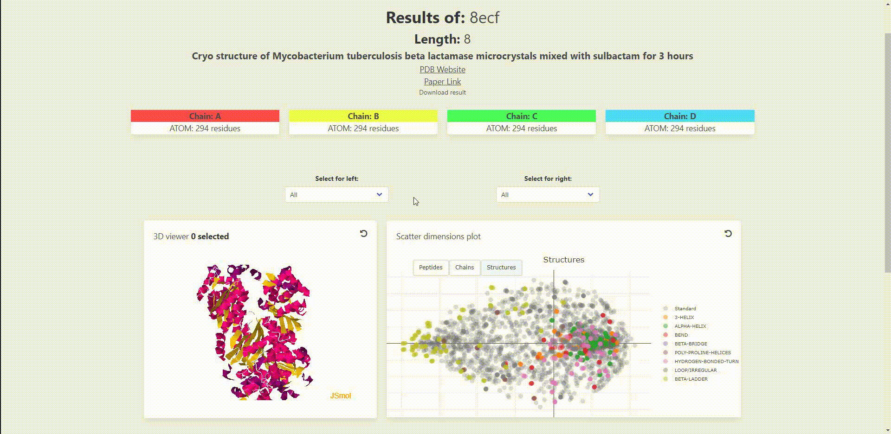

[](https://opensource.org/licenses/MIT)

# Peptidomics Spring Boot Project

Welcome to the Peptidomics repository! This project focuses on the analysis and exploration of peptide data using advanced computational techniques.



## Table of Contents

* Introduction
* Installation
* Usage
* Features
* Contributing
* License
* Credits

## Introduction

The majority of the biological machinery is made up of proteins, which are just lengthy chains of connected amino acids. Although this relationship is exceedingly difficult to assess, in theory, the structure, dynamics, and function of such proteins follow from the individual building pieces.

An oligopeptide, which is made up of building units spanning multiple amino acids, is frequently preferable. Many similar oligopeptides are also known to serve significant purposes on their own. On the broader range of such peptides, not much is known. Their configurational qualities are one of them. The oligopeptide's conformational flexibility, the secondary structure annotations that correlate to those shapes, and their three-dimensional capabilities.

This software is the creation of something that essentially combines PCA and multilinear regression to translate the protein structure between its actual configurations and a low-dimensional abstract data space.

## Requirements
````
Java (min. version 8)
    Gradle (version 7.4)
    Spring (version 3.0.2)
    Spring Security (version 2.0.4-RELEASE)
    Spring Security Config
    Spring Thymeleaf
    Commons IO (version 2.11.0)

Python (min. version 3.9)
    Numpy (version 1.23.1)
    MDAnalysis (version 2.4.2)
    Scikit-Learn (version 0.23.2)
````
## Installation
Clone this repository to your local machine:
````
git clone https://github.com/AlfonsoJan/Peptidomics.git
````

Install the required Python dependencies:
````
pip install -r requirements.txt
````

Move/Copy the `data` folder with the folders `scores`, `scripts` and `vectors` and their content to a directory of your choice outside the project.
Change the attribute python.executable.folder in application.properties to the location of these directories.
```
python.executable.folder=/<parent directory>/
```

They need to be in the same parent directory. Like this:

```
parent directory/
├── scores
├── scripts
├── vectors
```

Set the directory for the log file of the python script. And your the python command of the server this runs on. Like py, python or python3.

```
python.logging.folder=/<logging folder>/
python.path-name=<python command>
```

#### **ALL THE DIRECTORIES IN APPLICATION>PROPERTIES SHOULD START AND END WITH '/'**

Create the .jar file with the following command:
```
gradle bootjar
```
Or use the bootjar build option in IntelliJ.


## Usage

Set in the application.properties the python.path-name to your python3 shortcurt (eg, py, python, python3)

Open a terminal and move to the location of the jar file. And run the jar file:
```
java -jar PeptidomicsWebApp.jar
```

## Contributors
```
John Busker (j.a.busker@st.hanze.nl)
Wouter Zeevat (w.h.zeevat@st.hanze.nl)
```

## Credits
WebGL interface written by Takanori Nakane. Java2Script written by Zhou Renjian, et al. Jzlib written by Atsuhiko Yamanaka. 
